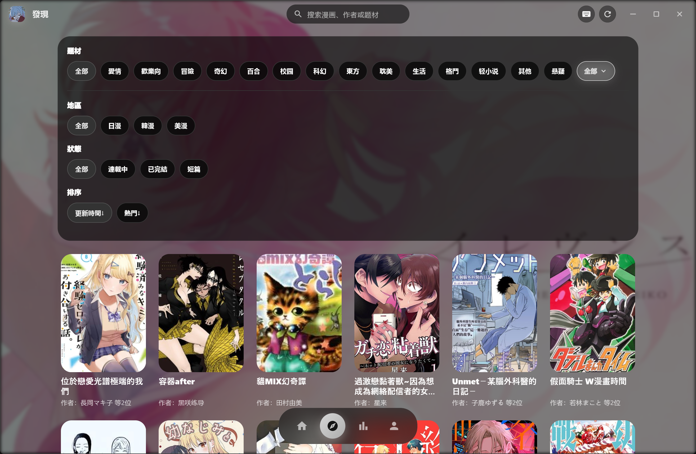
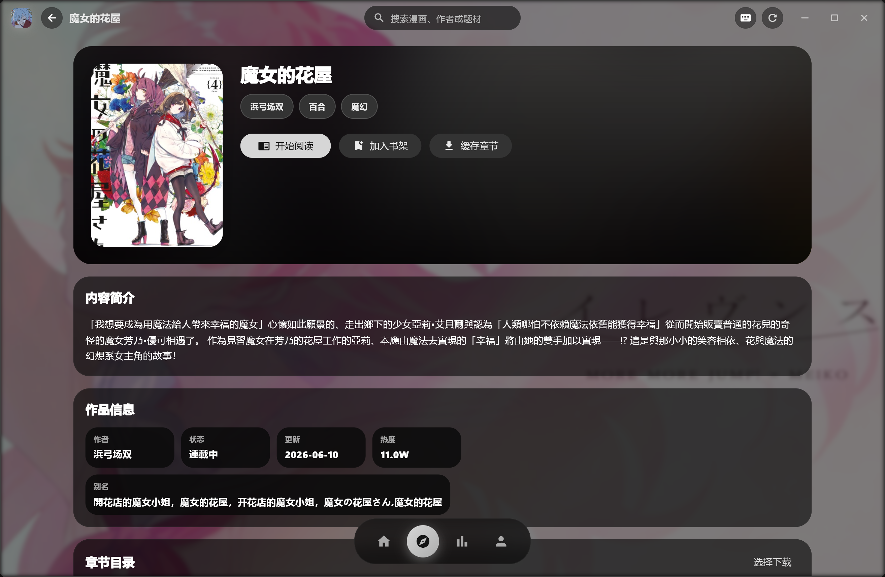

<div align="center">


# EasyCopy

<p>
  <a href="https://github.com/huangusaki/EasyCopy/releases/latest"></a>
  
  <a href="https://github.com/huangusaki/EasyCopy/releases"></a>
</p>

</div>

---

基于 Flutter 开发，通过后台 WebView 提取站点数据并交由原生 UI 渲染，兼顾数据源的扩展性与原生页面的流畅体验。支持 **Android** 和 **Windows** 平台。

## ✨ 特性

- **阅读**：纵向/横向翻页、双指缩放、进度记忆、音量键翻页。
- **发现**：分类筛选、排行榜、全局搜索及本地书架管理。
- **缓存**：离线下载、断点续传与缓存目录迁移。
- **网络**：节点自动探测切换，支持原生与网页双重登录方案。
- **外观**：内置多套主题，支持深浅色跟随系统与 Material You。
- **桌面端**：Windows 版专属响应式布局、全局快捷键及沉浸式全屏。

## 📸 截图

### 📱 Android 端

<div align="center">

<table>
  <tr>
    <td align="center"><strong>发现筛选</strong></td>
    <td align="center"><strong>作品详情</strong></td>
  </tr>
  <tr>
    <td align="center"></td>
    <td align="center"></td>
  </tr>
  <tr>
    <td align="center"><strong>阅读页 & 评论</strong></td>
    <td align="center"><strong>阅读设置</strong></td>
  </tr>
  <tr>
    <td align="center"></td>
    <td align="center"></td>
  </tr>
</table>

</div>

### 💻 Windows 端

<div align="center">

<table>
  <tr>
    <td align="center"><strong>发现筛选</strong></td>
    <td align="center"><strong>设置</strong></td>
  </tr>
  <tr>
    <td align="center"></td>
    <td align="center"></td>
  </tr>
</table>

</div>

## 📥 下载

前往 [**Releases**](https://github.com/huangusaki/EasyCopy/releases/latest) 获取最新版本：

| 平台 | 文件 | 说明 |
| --- | --- | --- |
| Android | `<版本>-android-<abi>.apk` | 按 CPU 架构分包，新手机一般选 `arm64-v8a` |
| Windows | `<版本>-windows-x64.zip` | 解压后运行exe，免安装 |

> Windows 端的网页登录依赖 **WebView2 Runtime**（Windows 11 已内置；Windows 10 如缺失，应用会提示安装）。

## 🛠️ 从源码构建

环境要求：Flutter stable（CI 使用 3.41.4）、Dart 3.9+；Android 端额外需要 Android SDK 与 Java 17。

```bash
flutter pub get

# 调试运行
flutter run -d android      # Android
flutter run -d windows      # Windows
```

发布构建：

```bash
# Android（按 ABI 分包）
flutter build apk --release \
  --target-platform=android-arm,android-arm64,android-x64 --split-per-abi

# Windows
flutter build windows --release
```

推送 `v*` tag 会触发 GitHub Actions 自动构建并发布 Android 与 Windows 产物。tag 必须与 `pubspec.yaml` 的 `version` 一致（如 `v2.6.0`）；若存在 `.github/release-notes/v<版本>.md`，其内容会作为该次 Release Note。

## 🧱 项目结构

Flutter 工程，核心代码位于 `lib/`：

- `app_screen/` — 主界面状态、导航、WebView 数据管线与页面缓存
- `reader/` — 阅读器界面、控制器、滚动与进度逻辑
- `services/` — 网络、解析、缓存、下载、进度、登录、节点等服务
- `models/` · `widgets/` · `webview/` — 数据模型、复用组件、页面提取脚本

## ⚠️ 声明

本项目为第三方客户端，仅供学习交流与个人使用，与任何漫画站点无关。请支持正版，下架及侵权内容请联系对应站点处理。

---

<div align="center">
  <sub>Built by <a href="https://github.com/huangusaki">Huangusaki</a></sub>
</div>
