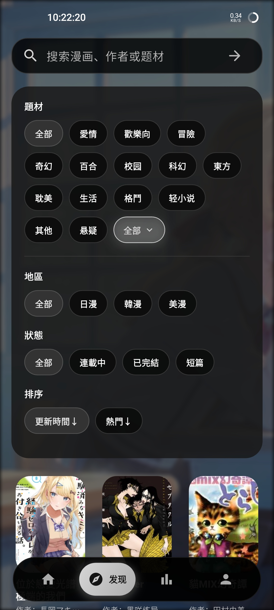
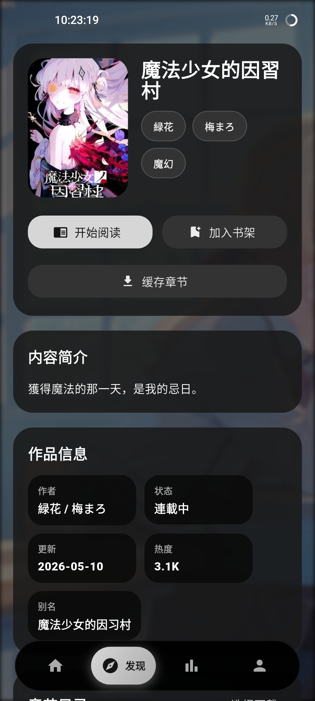
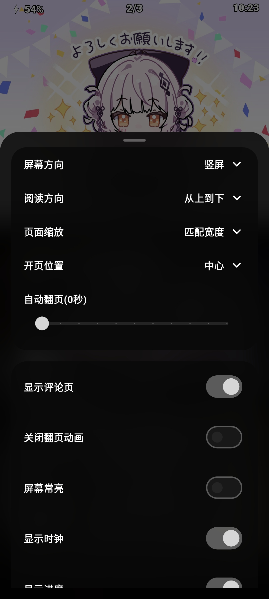

<div align="center">

<h1>EasyCopy</h1>
  <p>安卓漫画阅读器</p>
</div>

---

第三方漫画客户端。基于 Flutter 实现界面，通过 WebView 加载目标站点页面并提取所需数据。

## 功能

- 原生首页、发现、排行、搜索、详情、个人页
- 阅读器：纵向滚动 / 左右翻页两种模式，含双指缩放、拖拽进度条、适屏、全屏、常亮、音量键翻页、自动翻页、进度记忆，以及章节评论
- 搜索历史可保存与删除
- 登录以原生表单为主，失败时回退到网页登录；未登录状态下收藏与历史保存在本地
- 启动时自动探测可用节点，网络异常时自动切换，也支持手动锁定
- 下载支持暂停、继续、重试，缓存目录可迁移，已缓存漫画可重新导入
- 内置版本检查与更新提示
- 浅色 / 深色主题

## 截图

<div align="center">

<h3>浏览</h3>

<table>
  <tr>
    <td align="center"><strong>发现筛选</strong></td>
    <td align="center"><strong>作品详情</strong></td>
  </tr>
  <tr>
    <td align="center"></td>
    <td align="center"></td>
  </tr>
</table>

<h3>阅读</h3>

<table>
  <tr>
    <td align="center"><strong>阅读页</strong></td>
    <td align="center"><strong>阅读设置</strong></td>
  </tr>
  <tr>
    <td align="center"></td>
    <td align="center"></td>
  </tr>
</table>

</div>

## 开发

环境要求：Flutter stable、Dart 3.9+、Android SDK、Java 17。

```bash
flutter pub get
flutter run -d android
```

## 构建

```bash
flutter build apk --release --target-platform=android-arm,android-arm64,android-x64 --split-per-abi
```

产物输出至 `build/app/outputs/flutter-apk/`。

推送 `v*` tag 会触发 GitHub Actions 完成构建与发布。若仓库中存在 `.github/release-notes/v<版本号>.md`，其内容会作为本次 Release Note 使用。

---

<div align="center">
  <p>Built by Huangusaki</p>
</div>
